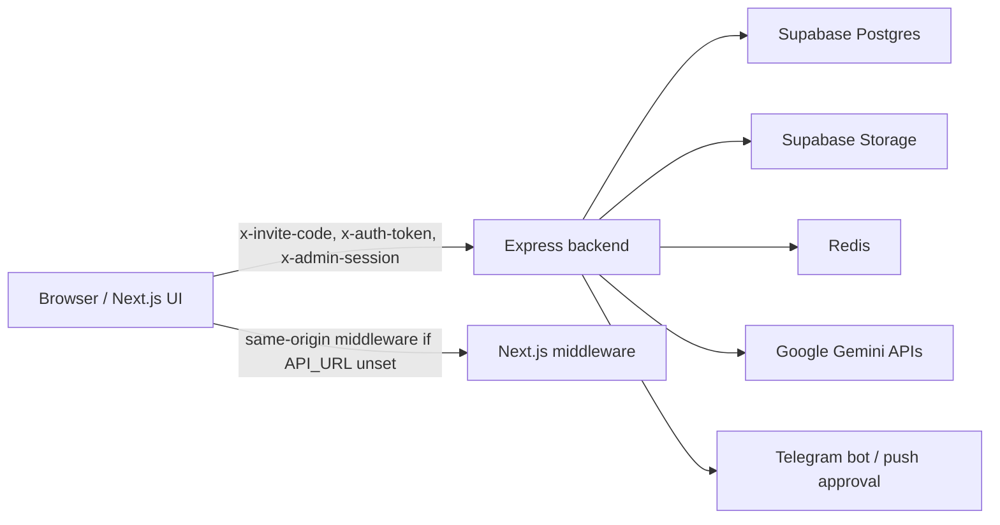
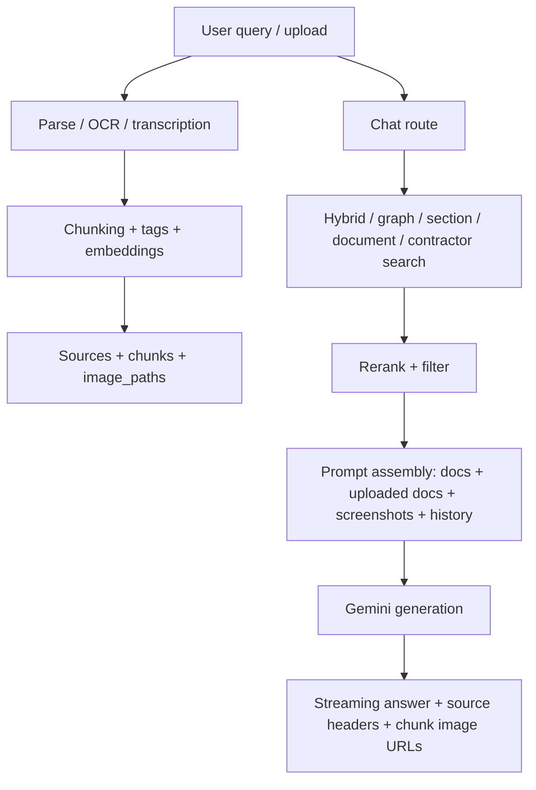

# Аудит безопасности, RAG и архитектуры репозитория snab-chat

## Executive summary

Проверка репозитория KirillTrubitsyn/snab-chat на entity["company","GitHub","code hosting platform"] показывает зрелую, но уже довольно сложную систему: фронтенд на `Next.js`, отдельный backend на `Express`, `Supabase` как основное хранилище и storage, `Redis` для rate limiting, а `Google Gemini` — и для генерации ответов, и для OCR/эмбеддингов. В коде уже есть заметные меры защиты: `helmet`, проверка `Origin`, 2FA для админов, вынесенный service-auth, distributed rate limiting, secret scanning и `npm audit` в CI. Это хороший фундамент. fileciteturn52file0 fileciteturn67file0 fileciteturn80file0

Однако в текущем состоянии я вижу несколько сильных рисков, которые я бы отнёс к приоритетным. Самые важные из них: передача raw invite/admin-кода в query string для загрузки приватных изображений, клиентски управляемый выбор bucket/path в `/api/parse`, уязвимые версии `multer`, `undici` и `next`, а также архитектурный drift между фронтенд-мидлварью и реальным backend rate limiting для auth/OTP-потока. Дополнительно сам RAG-контур стал очень тяжёлым: много параллельных поисков, повторных эмбеддингов, image-loading, двухступенчатый rereank и большой system prompt, из-за чего растут latency, quota pressure и вероятность деградации качества. fileciteturn58file0 fileciteturn66file0 fileciteturn75file0 fileciteturn74file0 fileciteturn82file0 fileciteturn67file0 fileciteturn60file0 fileciteturn62file0 fileciteturn61file0

Критически важный вывод: прямого признака RCE или классической публичной SQL injection в просмотренных боевых маршрутах я не увидел; основные проблемы сосредоточены на стыке авторизации, transport security, storage boundary, supply-chain и операционной устойчивости RAG. Это означает, что исправления будут не столько “переписать всё”, сколько “закрыть несколько действительно опасных разрывов и упростить контур”. fileciteturn52file0 fileciteturn58file0 fileciteturn66file0 fileciteturn75file0 fileciteturn76file0

## Архитектура и модель угроз

Система выглядит так: браузер вызывает либо same-origin API, либо внешний backend через `NEXT_PUBLIC_API_URL`; backend обслуживает auth, chat, parsing, ingestion, fetch-url, admin и служебные маршруты; данные и оригинальные документы лежат в `Supabase`, а при ответе чат собирает фрагменты документов, изображения чанков, историю диалога и отправляет всё это в Gemini. Это сразу задаёт четыре главные зоны риска: транспорт bearer-артефактов, разграничение доступа к storage, устойчивость auth-потока и утечки данных во внешнюю LLM/OCR-платформу. fileciteturn74file0 fileciteturn52file0 fileciteturn70file0 fileciteturn58file0 fileciteturn78file0



Точка, которая особенно важна для threat model: во фронтенде есть строгая CSP и подробный auth-oriented rate limiting, но при включённом `NEXT_PUBLIC_API_URL` реальные запросы идут на внешний backend, где набор лимитов уже другой. То есть часть защит фронтенда может просто не находиться на пути боевого трафика. Это не “формальная” проблема — именно так появляются разрывы между тем, что команда считает защищённым, и тем, что реально защищено в production. fileciteturn82file0 fileciteturn74file0 fileciteturn67file0



Для атакующего поверхность выглядит так: auth endpoints, upload/parse/ingest, `/api/chat`, `/api/fetch-url`, `/api/chunk-image`, admin endpoints, Telegram webhook/service-auth. Наиболее реалистичные сценарии — это не взлом “через один чудо-эксплойт”, а эксплуатация слабых связок: leaked token in URL, brute-force по auth/OTP там, где лимиты расходятся, DoS через загрузки/мультимодальные сценарии, доступ к не тому bucket/object через служебный service client, и data exfiltration через RAG/OCR pipeline. fileciteturn52file0 fileciteturn66file0 fileciteturn75file0 fileciteturn76file0 fileciteturn77file0

## Ключевые уязвимости и дефекты

Ниже — сводка наиболее значимых находок.

| Severity | Находка | Доказательство | Практический эффект | Ремедиация |
|---|---|---|---|---|
| High | Raw invite/admin-код уходит в URL `?token=` для `/api/chunk-image`, а ответ кэшируется как `public, immutable` | `backend/src/routes/chat.ts`; `backend/src/routes/misc.ts` fileciteturn58file0 fileciteturn66file0 | Утечка bearer-артефактов через URL, логи, history, proxy/cache; route не делает object-scoped authorization, а только проверяет валидность кода | Короткоживущий HMAC/JWT download token, `Cache-Control: private, no-store`, привязка токена к path и expiration |
| High | `/api/parse` принимает `storageBucket` и `storagePath` от клиента и скачивает объект через service-role client | `backend/src/routes/parse.ts`; `backend/src/lib/supabase.ts`; bucket names видны и в других маршрутах fileciteturn75file0 fileciteturn70file0 fileciteturn54file0 fileciteturn76file0 | Authenticated user может заставить backend читать не тот storage bucket/object, если знает или угадает path; это breakout из intended access boundary | Жёсткий allowlist bucket’ов, path prefix per user/session, отдельные endpoints для user/admin uploads |
| High | Upload endpoints сидят на `multer@1.4.5-lts.1` с `memoryStorage()` и лимитом 50 MB | `backend/package.json`; `backend/src/routes/parse.ts`; `backend/src/routes/ingest.ts` fileciteturn51file0 fileciteturn75file0 fileciteturn76file0 | Повышенный риск DoS по памяти/процессу даже без учёта больших OCR/embedding workloads | Обновить до `multer >= 2.0.1`, перейти на streaming/temp-file handling, уменьшить лимиты и ввести content-type allowlist |
| Medium | “Защита backend URL” через `x-api-key` фактически не является секретом: ключ лежит в `NEXT_PUBLIC_BACKEND_API_KEY` и отправляется из браузера | `app/lib/api.ts`; backend key-check в `backend/src/index.ts` fileciteturn74file0 fileciteturn52file0 | Контроль ложной безопасности: любой, кто видит клиентский bundle/запросы, может воспроизвести тот же header | Убрать browser-exposed shared secret; оставить auth/session/origin или перейти на BFF/server-side signing |
| Medium | Реальные auth/OTP лимиты отличаются между фронтенд middleware и backend | `middleware.ts`; `app/lib/api.ts`; `app/components/InviteGate.tsx`; `backend/src/middleware/rate-limit.ts` fileciteturn82file0 fileciteturn74file0 fileciteturn73file0 fileciteturn67file0 | При внешнем backend пути `/api/auth/login-password`, `/verify-password`, `/verify-otp`, `/send-otp` могут получать только backend default-limit, а не строгие лимиты Next middleware | Единая rate-limit policy на backend как source of truth |
| Medium | `/api/migrate` остаётся в боевом коде и способен вызывать `exec_sql` RPC | `backend/src/routes/misc.ts` fileciteturn66file0 | При компрометации admin session impact становится “почти DBA” | Удалить маршрут из production build, оставить только out-of-band migration workflow |
| Medium | Race condition в лимите устройств: общий `deviceLimit` проверяется неатомарно | `backend/src/lib/auth.ts` fileciteturn55file0 | Параллельные регистрации с разными device IDs могут превысить лимит | DB transaction / RPC с row-level locking |
| Medium | Background summarization может гоняться сама с собой и удалять историю | `backend/src/lib/memory.ts` fileciteturn63file0 | Потеря контекста, деградация RAG, непредсказуемые ответы | Advisory lock / job queue / single-flight per conversation |

Версии зависимостей подтверждают supply-chain риск. В backend зафиксированы `multer@1.4.5-lts.1` и `undici@6.21.0`, а во frontend — `next@15.3.0`. Для `multer` официальные advisories указывают high-severity DoS-проблемы, исправленные только в `2.0.0` и `2.0.1`; для `undici` официально закрыты по меньшей мере issues до `6.21.1` и `6.21.2`; для `next` версия `15.3.0` попадает в диапазон уязвимости cache poisoning, исправленной в `15.3.3`. fileciteturn51file0 fileciteturn50file0 citeturn5search3turn5search4turn5search1turn4search6turn5search0

Отдельно отмечу очень неприятный дефект в `chunk-image` потоке. `chat.ts` формирует прокси-ссылки как `/api/chunk-image?path=...&token=${invite.code}`, а `misc.ts` разрешает по query param как admin code, так и обычный invite code, если `Referer` “похож” на допустимый домен. Это плохая модель даже без XSS: токен уже считается доставленным до браузера, а значит вы потеряли главное свойство секрета — невыводимость в URL. Более того, маршрут не проверяет, что конкретный `path` действительно относится к тому пользователю/диалогу, который предъявил код. fileciteturn58file0 fileciteturn66file0

Вторая сильная находка — `parse.ts`. Здесь есть `requireAuth`, но после него backend на service-role скачивает файл из bucket, имя которого пришло прямо из `req.body.storageBucket`. Это особенно опасно потому, что кодом явно используются несколько приватных bucket’ов: `documents`, `chat-uploads`, `chunk-images`. Если путь объекта известен, обычный пользователь может попытаться превратить parser в internal object reader. Даже если exploitability в конкретной инсталляции ограничится “только известными именами”, граница доступа уже нарушена по самому дизайну. fileciteturn75file0 fileciteturn70file0 fileciteturn54file0 fileciteturn76file0

Третья системная проблема — rate limiting на auth/OTP-потоке. На стороне Next middleware лимиты проработаны детально: отдельно для `login-password`, `verify-password`, `verify-otp`, `send-otp`, `setup-totp`. Но фронтенд сам же умеет ходить на внешний backend через `NEXT_PUBLIC_API_URL`; в backend middleware таких отдельных правил уже нет, а значит production topology может оказаться слабее, чем ожидалось по локальной архитектуре. Для brute-force и OTP abuse это именно тот тип ошибки, который долго остаётся незамеченным. fileciteturn82file0 fileciteturn74file0 fileciteturn73file0 fileciteturn67file0

Есть и менее громкие, но важные инженерные дефекты. В `backend/src/lib/auth.ts` устранён race только для дубля того же устройства, но не для общего лимита устройств; в `memory.ts` summarization и deletion старых сообщений выполняются fire-and-forget без координации; а в инфраструктуре есть расхождение версий Node: корневой `package.json` требует `24.x`, в CI и backend Docker используется `20`. Это не “уязвимость” само по себе, но это прямой источник регрессий, особенно для Next 15 / React 19 и для криптографии/streaming-поведения на разных рантаймах. fileciteturn55file0 fileciteturn63file0 fileciteturn50file0 fileciteturn34file0 fileciteturn80file0

## RAG и качество поиска

Сильная сторона реализации в том, что RAG уже далеко не примитивный: есть hybrid search, graph-aware search, section/document lookup, contractor-card retrieval, intent-aware rerank, агентный режим для сложных запросов, low-confidence fallback и учёт изображений в generation stage. Это серьёзная основа, и она явно решает реальные предметные кейсы, а не демонстрационную “чатовалку”. fileciteturn60file0 fileciteturn58file0 fileciteturn62file0

Но именно эта зрелость уже стала источником сложности. В deterministic path код способен запускать variant hybrid search, graph-aware search, contractor search, per-entity searches и ещё supplementary searches; в agentic path к этому добавляются pre-seeding, tool-driven cycle и последующая финализация. Поверх этого идёт LLM reranker, загрузка изображений из storage, сборка гигантского system prompt и возможная подгрузка истории диалога. Наличие `REQUEST_TIMEOUT_MS = 80_000` и специального degraded mode — косвенное подтверждение того, что latency budget уже на пределе. fileciteturn58file0 fileciteturn60file0 fileciteturn62file0

| Область | Наблюдение | Почему это важно | Доказательство | Что делать |
|---|---|---|---|---|
| Retrieval fan-out | Слишком много параллельных поисков и допоисков | Рост p95/p99 latency, quota burn, нестабильность | `chat.ts`, `retrieval.ts`, `reranker.ts` fileciteturn58file0 fileciteturn60file0 fileciteturn62file0 | Ввести retrieval budget и circuit breakers |
| Multimodal retrieval gap | `embedDocuments()` умеет изображения, но ingest сознательно эмбеддит только текст | Скриншот-heavy документы плохо находятся семантически | `embeddings.ts`, `ingest.ts`, `chat.ts` fileciteturn61file0 fileciteturn76file0 fileciteturn58file0 | Separate image-caption embeddings или dual index |
| Prompt/context bloat | В prompt входят KB-документы, uploaded docs до 50k chars каждый, история, registry-блоки, low-confidence hints, изображения | Повышенная вероятность truncation, деградации качества и стоимости | `chat.ts`, `memory.ts` fileciteturn58file0 fileciteturn63file0 | Token budgeting, staged answering, context compression |
| Data leakage to third parties | OCR PDF/DOC/image/audio и generation идут через Gemini | Комплаенс-риск для чувствительных файлов | `parser.ts`, `chat.ts`, `embeddings.ts` fileciteturn78file0 fileciteturn58file0 fileciteturn61file0 | DLP/redaction/classification gate перед внешним API |
| Stateful races | Background summarization и device registration не сериализованы | Потеря истории, превышение лимитов, flaky UX | `memory.ts`, `auth.ts` fileciteturn63file0 fileciteturn55file0 | Queue / RPC transactions / advisory locks |

Есть ещё одна важная содержательная проблема: retrieval и generation логически разошлись. В `ingest.ts` embeddings строятся из текста, хотя helper в `embeddings.ts` поддерживает мультимодальность; зато в `chat.ts` изображения чанков загружаются и подмешиваются уже на финальной стадии генерации. Это значит, что визуально важный документ может не попасть в candidate set вовсе, и тогда никакая поддержка image-based reasoning уже не поможет. То есть мультимодальность здесь пока улучшает answering, но почти не улучшает retrieval. fileciteturn61file0 fileciteturn76file0 fileciteturn58file0

С точки зрения hallucination risk картина смешанная. Хорошо, что в system prompt заложены жёсткие правила “отвечать только по документам”, а для prompt injection есть отдельная санация и Unicode normalisation. Хорошо и то, что есть флаг `lowConfidence` и даже degraded no-LLM mode при quota exhaustion. Но при такой сложности контура качество всё сильнее зависит не от одного алгоритма, а от дисциплины всего pipeline: объёма контекста, стабильности reranker, качества поиска по организации/режиму и отсутствия race conditions в истории диалога. Иными словами, сегодня главный риск не “модель выдумала”, а “система подала ей не тот или неполный контекст”. fileciteturn58file0 fileciteturn60file0 fileciteturn62file0 fileciteturn63file0

## Приоритетный план исправления

Ниже — план, который я считаю рациональным с точки зрения риска и трудоёмкости.

| Горизонт | Действие | Effort | Снижение риска |
|---|---|---:|---|
| Немедленно | Убрать raw code из `/api/chunk-image`, перевести на короткоживущие signed tokens, отключить `public` caching | S | Очень высокое |
| Немедленно | Закрыть `storageBucket`/`storagePath` allowlist’ом и path scoping в `/api/parse` | S | Очень высокое |
| Немедленно | Обновить `multer`, `undici`, `next`; пересобрать и задеплоить | S-M | Высокое |
| Немедленно | Перенести auth/OTP rate limits на backend как единственный источник истины | S | Высокое |
| Короткий срок | Удалить/загейтить `/api/migrate` и похожие service endpoints из production | S | Высокое |
| Короткий срок | Убрать концепцию browser-exposed `BACKEND_API_KEY` | M | Среднее |
| Короткий срок | Сделать транзакционный контроль device limit и single-flight summarization | M | Среднее |
| Средний срок | Ввести retrieval budget, semantic cache и метрики per-stage latency | M | Высокое для стабильности |
| Средний срок | Добавить DLP/classification gate перед OCR/chat/embedding вызовами | M-L | Высокое для комплаенса |
| Средний срок | Привести runtime targets к одной версии Node и унифицировать deployment modes | S | Среднее |

Первый патч, который я бы внёс сразу, — замена raw `token=<invite.code>` на короткоживущий подписанный токен, привязанный к `path`, сроку жизни и типу ресурса. Это закрывает самую неприятную находку в transport layer. fileciteturn58file0 fileciteturn66file0

```ts
// backend/src/lib/chunk-image-token.ts
import { createHmac, timingSafeEqual } from "node:crypto";

const SECRET = process.env.CHUNK_IMAGE_TOKEN_SECRET!;
const TTL_MS = 60_000; // 1 minute

export function signChunkImageToken(path: string) {
  const exp = Date.now() + TTL_MS;
  const payload = `${path}:${exp}`;
  const sig = createHmac("sha256", SECRET).update(payload).digest("hex");
  return Buffer.from(`${payload}:${sig}`).toString("base64url");
}

export function verifyChunkImageToken(token: string, expectedPath: string): boolean {
  try {
    const raw = Buffer.from(token, "base64url").toString("utf8");
    const [path, expStr, sig] = raw.split(":");
    if (path !== expectedPath) return false;
    const exp = Number(expStr);
    if (!Number.isFinite(exp) || exp < Date.now()) return false;

    const expected = createHmac("sha256", SECRET)
      .update(`${path}:${exp}`)
      .digest("hex");

    return timingSafeEqual(Buffer.from(sig, "hex"), Buffer.from(expected, "hex"));
  } catch {
    return false;
  }
}
```

```ts
// backend/src/routes/misc.ts
router.get("/api/chunk-image", async (req, res) => {
  const path = String(req.query.path || "");
  const token = String(req.query.token || "");

  if (!path || !token || !verifyChunkImageToken(token, path)) {
    return res.status(401).send("Unauthorized");
  }

  // ...
  res.setHeader("Cache-Control", "private, no-store");
});
```

Вторая обязательная правка — жёстко закрыть `storageBucket` и `storagePath` в `/api/parse`. Сейчас это boundary failure, а не просто “input validation nice to have”. fileciteturn75file0 fileciteturn70file0

```ts
// backend/src/routes/parse.ts
const USER_PARSE_BUCKETS = new Set(["chat-uploads"]);
const ADMIN_PARSE_BUCKETS = new Set(["documents"]);

function normalizeStoragePath(p: string): string | null {
  if (!p || p.includes("..") || p.startsWith("/") || p.startsWith("\\")) return null;
  return p.replace(/^\/+/, "");
}

router.post("/api/parse", upload.single("file"), async (req, res) => {
  const auth = await requireAuth(req, res);
  if (!auth) return;

  const rawBucket = String(req.body.storageBucket || "documents");
  const rawPath = String(req.body.storagePath || "");
  const storagePath = normalizeStoragePath(rawPath);

  const allowedBuckets = auth.isAdmin ? new Set([...USER_PARSE_BUCKETS, ...ADMIN_PARSE_BUCKETS]) : USER_PARSE_BUCKETS;
  if (!allowedBuckets.has(rawBucket)) {
    return res.status(400).json({ error: "Bucket not allowed" });
  }
  if (rawPath && !storagePath) {
    return res.status(400).json({ error: "Invalid storagePath" });
  }

  // user scope example
  if (!auth.isAdmin && storagePath && !storagePath.startsWith(`user/${auth.inviteCodeId}/`)) {
    return res.status(403).json({ error: "Forbidden storage path" });
  }

  // continue...
});
```

Третья правка — не пытаться «прятать» backend за `NEXT_PUBLIC_BACKEND_API_KEY`. Пока этот ключ отправляется из браузера, это не секрет, а лишь дополнительный header. Либо убрать эту схему совсем и полагаться на реальную auth/session/origin-модель, либо перейти на BFF/server-side proxy, где shared secret остаётся только между серверными компонентами. fileciteturn74file0 fileciteturn52file0

```ts
// app/lib/api.ts
// Удалить browser-exposed x-api-key.
// Оставить только user/admin auth headers.

export function getAuthHeaders(): Record<string, string> {
  if (typeof window === "undefined") return {};
  const headers: Record<string, string> = {};
  const code = localStorage.getItem("snabchat_invite_code") || "";
  const token = sessionStorage.getItem("snabchat_auth_token") || "";
  const adminSession = sessionStorage.getItem("snabchat_admin_session") || "";

  if (code) headers["x-invite-code"] = encodeURIComponent(code);
  if (token) headers["x-auth-token"] = token;
  if (adminSession) headers["x-admin-session"] = adminSession;
  return headers;
}
```

## Тесты, CI/CD и наблюдаемость

Текущий CI закрывает только базовый слой: secret scanning через `gitleaks` и dependency audit через `npm audit`. Этого недостаточно для приложения, где основная сложность сосредоточена в auth state machine, маршрутах загрузки, RAG budget и многосервисных границах. fileciteturn80file0

Ниже — план неразрушающего тестирования, который соответствует вашему ограничению “code review + local/staging only”.

| Направление | Что проверять | Инструмент | Критерий успеха |
|---|---|---|---|
| Token leakage | `X-Chunk-Images` не содержит invite/admin code; no-store/private cache | Playwright + HAR inspection | В URL нет bearer-кодов |
| Storage breakout | `/api/parse` не читает чужие bucket/path | Supertest/Vitest | `400/403` на любой bucket вне allowlist |
| Upload DoS | malformed multipart, empty field names, больший файл, burst uploads | k6 + crafted multipart fixtures | Процесс не падает, ошибки управляемые |
| Auth brute force | `login-password`, `verify-password`, `verify-otp`, `send-otp` реально лимитируются backend | k6 / Artillery | Жёсткие `429` по backend, не только по Next middleware |
| Device race | параллельные логины с разными `device_id` | Vitest + Promise.all | Лимит устройств не превышается |
| Memory race | параллельные сообщения в длинном диалоге | Vitest integration | История не теряется, summary не дублируется |
| RAG regression | golden set по 30–50 доменным вопросам | custom harness | recall/precision и latency не регрессируют |

В CI/CD я бы обязательно добавил `CodeQL` или `Semgrep` для SAST, dependency scanning не только через `npm audit`, но и через GitHub Dependabot / OSV, contract-tests для auth routes, а также отдельный RAG regression job. Для этой системы особенно важно тестировать не только “код компилируется”, но и “retrieval budget не разъехался”, “latency по p95 не выросла”, “источники не смешиваются между режимами 223-ФЗ / вне 223-ФЗ”. Текущая реализация уже содержит много логирования и флагов деградации, на них можно опереться. fileciteturn58file0 fileciteturn60file0 fileciteturn62file0 fileciteturn80file0

Для monitoring я бы вывел минимум такие метрики: `chat.pipeline.total_ms`, `chat.retrieval.count`, `chat.rerank.ms`, `chat.images.loaded`, `chat.low_confidence.rate`, `chat.degraded.rate`, `auth.login_password.429_rate`, `parse.storage_bucket.rejects`, `parse.mime.rejects`, `chunk_image.token.verify_failures`, `memory.summary.jobs`, `memory.summary.races`. Сейчас логи позволяют многое увидеть постфактум, но не дают нормального operational SLA на RAG-контур. fileciteturn58file0 fileciteturn63file0 fileciteturn67file0

## Идеи развития продукта

Архитектура уже содержит хорошие зачатки для следующего уровня продукта: есть `lowConfidence`, `X-Sources`, `chunkImages`, dual path agentic/deterministic, contractor-card search и knowledge-graph refinement. Из этого можно сделать гораздо более сильный enterprise-grade UX. fileciteturn58file0 fileciteturn60file0

| Инициатива | Зачем это нужно | На чём уже можно строить |
|---|---|---|
| Claim-level provenance | Показывать цитату/табличную строку под каждым тезисом ответа | `X-Sources`, chunk selection, строгий prompt |
| ACL-aware retrieval | Ограничивать retrieval на уровне документа/организации/роли | уже есть auth, admin roles, storage buckets |
| Semantic cache | Снижать latency и quota cost для повторяющихся запросов | стабильный query enrichment и low-temp generation |
| RAG eval console | Видеть recall/precision/search path для золотого набора вопросов | graph-aware + deterministic/agentic split |
| DLP / document classification | Отсекать чувствительные файлы до отправки во внешнюю модель | parser/chat already centralize file flow |
| Freshness & diff alerts | Подсвечивать, что документ заменён/устарел | `sources`, `content_sha256`, dedup logic |
| Safer admin ops | Убрать “операционный SQL из web API”, вынести в runbooks/jobs | existing audit log and admin session model |

Самая перспективная продуктовая линия — не “ещё больше агентности”, а управляемая доказуемость ответа. Для внутреннего закупочного ассистента ценность растёт, когда пользователь видит не только “ответ”, но и “из какого документа/пункта он получен”, “почему второй режим не учтён”, “что именно было недонайдено”. У вас уже есть почти все строительные блоки, чтобы сделать это лучше большинства корпоративных RAG-систем. fileciteturn58file0 fileciteturn60file0

## Ограничения исследования

Анализ выполнен как изучение репозитория и архитектуры без live-доступа к окружению, БД, секретам и production traffic. Поэтому я не подтверждал фактическое состояние `Supabase` migrations/RLS, реальные bucket policies, включён ли `NEXT_PUBLIC_API_URL` в production, есть ли `REDIS_URL`, и какие именно backend routes реально опубликованы наружу. Там, где вывод зависит от topology, я отмечал это как условный риск, а не как установленный инцидент. fileciteturn74file0 fileciteturn67file0 fileciteturn69file0

Я также не проводил destructive testing, не исполнял OCR/ingest против реальных файлов и не делал полный line-by-line review каждого файла репозитория. Выводы поэтому нужно воспринимать как high-confidence audit по самым нагрузочным и рискованным траекториям: auth, upload/parse/ingest, chunk-image transport, chat/RAG pipeline, dependency surface и deployment drift. Именно эти зоны, на мой взгляд, и определяют текущий риск-профиль приложения. fileciteturn52file0 fileciteturn58file0 fileciteturn66file0 fileciteturn75file0 fileciteturn76file0